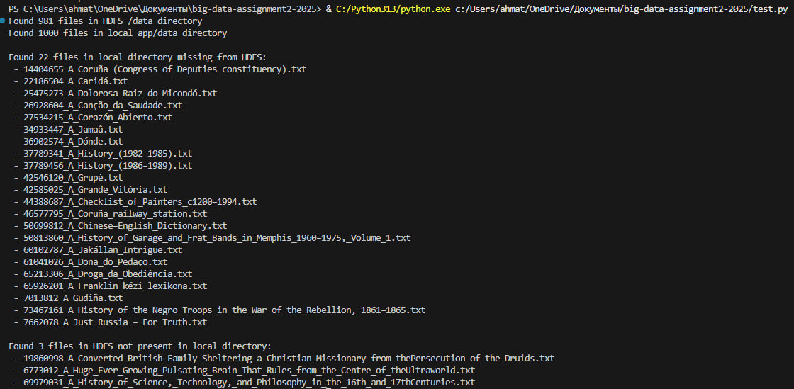
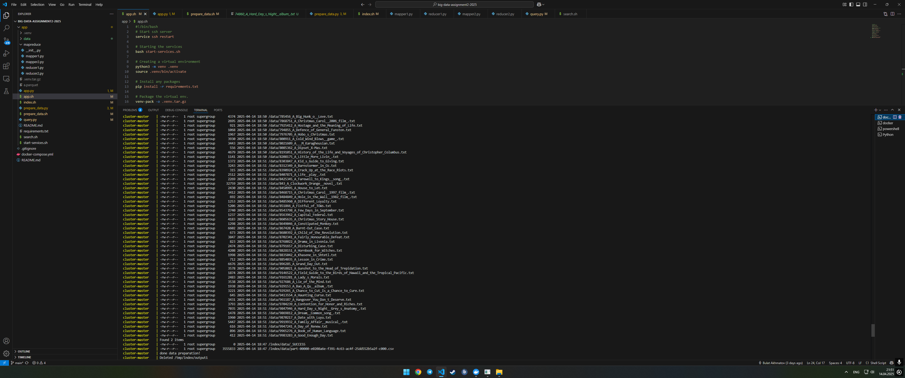
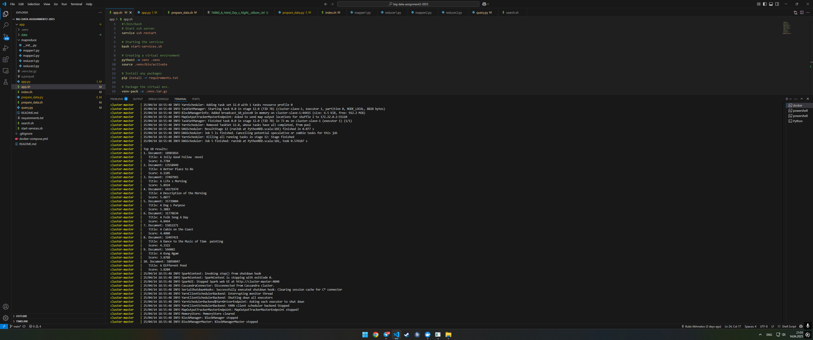

# Big Data Search Engine Implementation

## Methodology

### Data Preparation
```python
# Normalize document text and create files
def normalize_text(text):
    return re.sub(r'\s+', ' ', text).strip()

# Create sanitized filenames for HDFS compatibility
title = row['title'].encode('ascii', 'ignore').decode('ascii')
title = re.sub(r'[^a-zA-Z0-9_\-.]', '_', title)
```

Using prepare_data.py provided by Firas Jolha, I faced the problem: many of titles contain non-ascii symbols, so I decided to substitude them 

### Two-Stage MapReduce Indexing
1. **First Stage**: Tokenizes documents, counts term frequencies, outputs document lengths
   ```python
   for token, count in counter.items():
       print(f"{token}::{doc_id}\t{count}")
   print(f"DOCLEN_{doc_id}\t{len(tokens)}")
   ```

2. **Second Stage**: Calculates inverse document frequency (IDF) for ranking
   ```python
   # for each term:
   idf = math.log(total_docs / doc_count)
   print(f"{term}\t{doc_count}\t{idf:.6f}")
   ```

### Cassandra Storage
The system uses three Cassandra tables to store the index:
- `inverted_index`: Maps terms to documents with term frequency
- `doc_stats`: Stores document metadata (length, title)
- `term_stats`: Contains corpus statistics (doc_count and idf)

### BM25 Search Algorithm
```python
def calculate_bm25(tf, doc_len, avg_doc_len, idf, k1=1.0, b=0.75):
    """Calculate BM25 score for a term-document pair"""
    return idf * (tf * (k1 + 1)) / (tf + k1 * (1 - b + b * (doc_len / avg_doc_len)))
```

The search component implements BM25 ranking using Spark, with optimizations like broadcast variables to efficiently share term statistics across worker nodes. Default k1 and b are basic - 1 and 0.75.

## Demonstration

### Running the System

The entire pipeline can be executed with a single command:
```bash
docker compose up
```

docker-compose.yml contains entrypoint to app/app.sh that:
1. Starts required services
2. Sets up a Python virtual environment
3. Prepares document data (1000 documents)
4. Runs the MapReduce indexing pipeline
5. Executes sample searches

### Screenshots and Results

**Data preparation and indexing:**

.png>)
.png>)

**Search Results for "this is a query!":**
.png>)
First document contains 1 'query', 0 'this', 4 'is', 7 'a', and 0 '!'

Despite the fact that there are 0 'this' and '!', this words are much more common than 'query', so importance of word query should be high, and it is - score is much higher than for other documents, since they don't have this important for query word.


**Search Results for "good morning":**

First document contains 3 'good' and 1 'morning'

Second document contains the same amount of 'good' and 'morning' as first one, but number of words is higher - 634 against 484.

### Key Findings

Search results for both queries are pretty interpretable.

The distributed architecture allows efficient processing of indexing and search. For me it was about 20 seconds for mapreduce and 0.5s for search. I think it's pretty good for cpu.

Challenges encountered included handling special characters in filenames and handling errors. I do like an ability to parallelize code with MapReduce, but this java errors aren't really interpretable. A lot of memory heap and garbage collector errors were encountered.